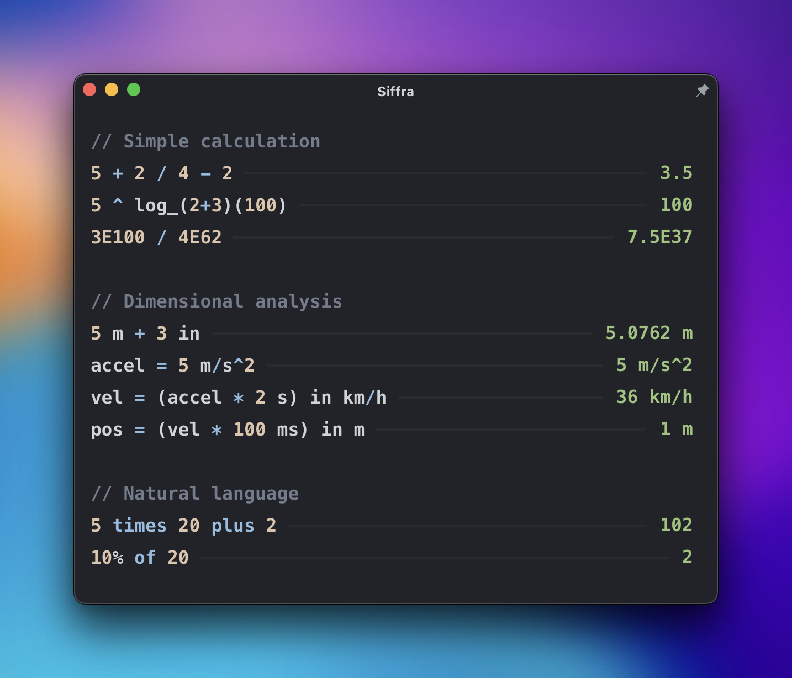

<div align="center">
    
</div>


# Siffra

Siffra is a beautiful, lightweight, fast, and accurate calculator with support for dimensional analysis.
The project is currently in heavy development, and is not currently stable yet. However, it is usable.

<div align="center">
    
</div>

## Installation
### Prebuild Binaries

There are provided prebuilt binaries for all supported platforms in the [Releases tab](https://github.com/ImpossibleReality/Siffra/releases).

### Building from source
To build Siffra from source, you will need to have the following installed:
- [Rust](https://www.rust-lang.org/tools/install)
- [Bun](https://bun.sh)

Once you have these installed, you can clone the repository and build Siffra with the following commands:
```sh
bun install
bun run tauri build
```

You will find the built binary in the `src-tauri/target/release/bundle` directory.

note: Siffra currently only *officially* supports macOS due to testing limitations, but I am working on adding support for Linux and Windows. Please open an issue if you have any problems running Siffra on your platform.

## Planned Features
- [x] Basic calculator functionality
- [x] Basic natural language support
- [x] Variables support
- [x] Dimensional analysis
- [x] Unit conversion
  - [x] Basic units
  - [x] Dimensions w/ multiple units + exponents (ie. m/s^2)
  - [ ] Electrical units
  - [ ] Derived units (ie. Jules, Newtons, etc.)
  - [ ] Currency/Stock units
  - [ ] Stoichiometry
- [ ] Improved syntax + error handling
- [ ] Syntax highlighting
- [ ] Support for saving calculations + multi-window support
- [ ] Custom defined functions
- [ ] Preferences page
- [ ] Plugin + theme system
- [ ] CAS support
- [ ] Graphing
- [ ] Improved natural language support (AI?)

## Contributing

Because Siffra is still under heavy development, I am not currently accepting contributions. However, once the project is more stable, I will be accepting contributions. Please do, however, feel free to [open an issue](https://github.com/ImpossibleReality/Siffra/issues/new) if you find a bug or have a feature request.

## Supporting the project
Unlike other calculators that provide similar functionality, Siffra is open-source, which also means I am unable to make a profit off of it. If you would like to support my future work, you can do so by buying me a coffee using the button below. Thank you!

<a href="https://www.buymeacoffee.com/johannovak" target="_blank"></a>

## License

Siffra is licensed under the [MIT License](https://opensource.org/license/mit/)
